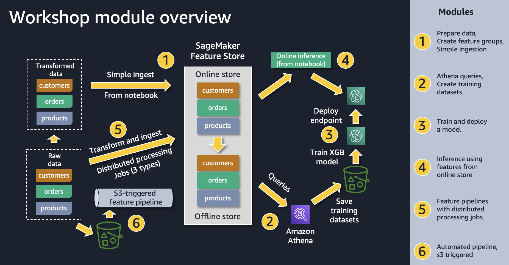

## SageMaker Feature Store Workshop 

**Please Note**: This repository includes a github submodule (ml-lineage-helper) which must also be cloned for certain notebook examples to run properly. Therefore, you must include the `--recursive` option when running git clone, like this:

~$ git clone --recursive https://github.com/aws-samples/amazon-sagemaker-feature-store-end-to-end-workshop.git

If you have already cloned the repository and need to pull the submodule code, you can run this command from the top-level directory of the repo:

~$ git submodule update --init --recursive

You should notice these lines of output during the clone of the submodule:

Submodule 'ml-lineage-helper' (https://github.com/aws-samples/ml-lineage-helper.git) registered for path 'ml-lineage-helper' 
Cloning into '/home/sagemaker-user/workshops/amazon-sagemaker-feature-store-end-to-end-workshop/ml-lineage-helper'...

* **Module 1: Feature Store Foundations**
    * **Topics:**
        * Dataset introduction
        * Creating a feature group
        * Ingesting a Pandas DataFrame into Online/Offline feature store
        * GetRecord, ListFeatureGroups, DescribeFeatureGroup

* **Module 2: Working with the Offline Store**
    * **Topics:**
        * Look at data in S3 console (Offline feature store)
        * Athena query for dataset extraction (via Athena console)
        * Athena query for dataset extraction (programmatically using SageMaker SDK)
        * Extract a training dataset and storing in S3
        
* **Module 3: Model training and batch scroing using extracted dataset from the Offline feature store**
    * **Topics:**
        * Training a model using feature sets derived from the Offline feature store
        * Perform batch scoring using feature sets derived from Offline feature store in CSV and Parquet format
        
* **Module 4: Leveraging the Online feature store**
    * **Topics:**
        * Get record from Online feature store during single inference
        * Get multiple records from Online store using BatchGet during batch inference 

* **Module 5: Scalable batch ingestion using distributed processing**
    * **Topics:**
        * Batch ingestion via SageMaker Processing job
        * Batch ingestion via SageMaker Processing PySpark job
        * SageMaker Data Wrangler export job to feature store
		
* **Module 6: Automate feature engineering pipelines with Amazon SageMaker**
    * **Topics:**
       * Leverage Amazon SageMaker Data Wrangler, Amazon SageMaker Feature Store, and Amazon SageMaker Pipelines alongside AWS Lambda to automate feature transformation.

* **Module 7: Feature Monitoring**
    * **Topics:**
       * Feature Group Monitoring Preparation, DataBrew Dataset Creation
       * Run Feature Group Monitoring using DataBrew Profile Job
       * Visualization of Feature Group Statistics and Feature Drift
	   
* **Module 8: Create, Delete and Query ML Lineage Tracking with Amazon SageMaker**
    * **Topics:**
		* Create/Delete ML Lineage.
		* Query ML Lineage by SageMaker Model Name or SageMaker Inference Endpoint
		* Given a SageMaker Model name or artifact ARN, you can find associated Feature Groups
		* Given a Feature Group ARN, and find associated SageMaker Models
		* Given a data source's S3 URI or Artifact ARN, you can find associated SageMaker Feature Groups
		* Given a Feature Group ARN, and find associated data sources

* **Module 9: Feature Security**
    * **Topics:**
       * Setup of granular access control to Offline Feature Store using AWS Lake Formation
       * Testing of the access control using SageMaker Feature Store SDK
